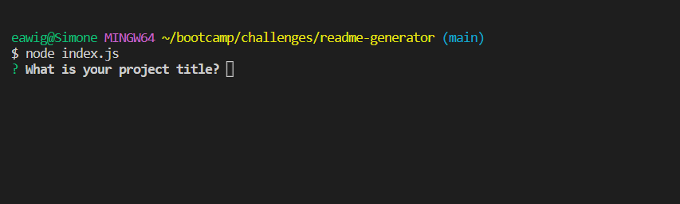
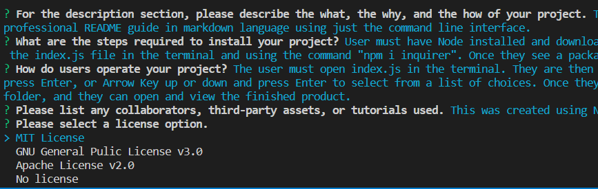

# Readme Generator

## Description
This application uses Node.js and Inquirer.js to allow users to create a professional README guide in markdown language using just the command line interface.

## Installation
User must have Node installed and download the repo to their local enviornment. Then they must install Inquirer by opening the index.js file in the terminal and using the command "npm i inquirer". Once they see a package-lock.json file appear in the repo, they are free to use the app.

## Usage
The user must open index.js in the terminal. They are then prompted with a series of questions, as shown here:

 

for which they must either type answers and press Enter, or Arrow Key up or down and press Enter, as shown here:

 

to select from a list of choices. Once they have answered all the prompts, their README file is generated in the "sample" folder, and they can open and view the finished product. 

A walkthrough video can be viewed [here.](https://drive.google.com/file/d/1w8f-LscFGFF1HKfLqTfRb9XFfuhVt5C8/view)

## Credits
This was created using Node.js, Inquirer.js and the documentation for each.    

## Questions
If you have any questions, you can reach me [here](mailto:ea.wiggans@gmail.com)

You can view my GitHub profile and repository [here](https://github.com/eawiggans)

